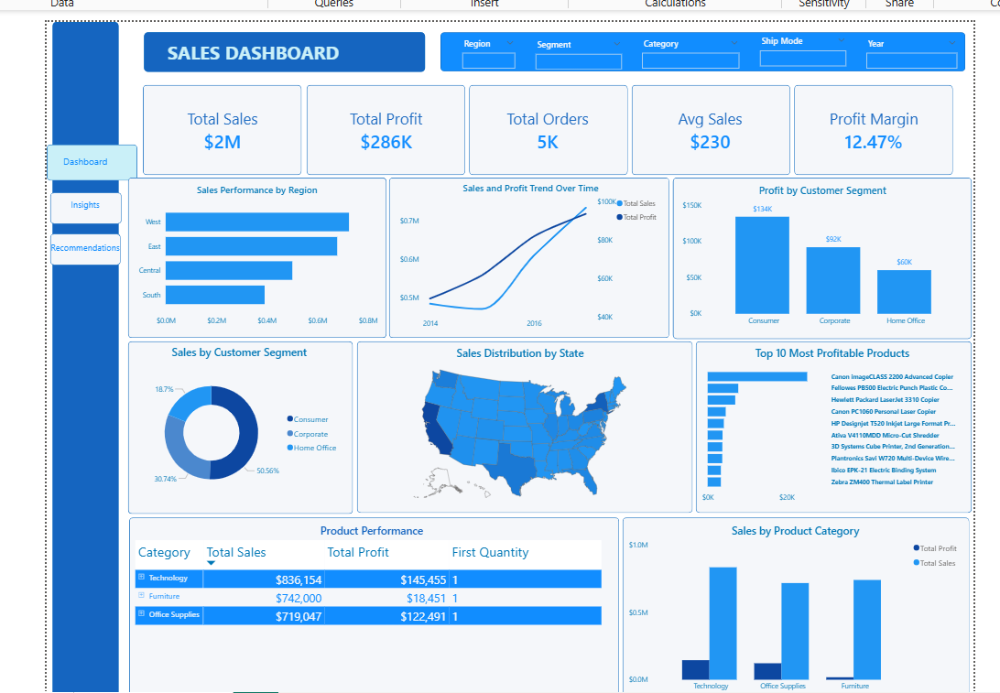

# Sales Performance Dashboard
This project analyzes retail sales performance using Microsoft Power BI.
The objective was to evaluate sales, profitability, customer segments, product categories, and regional performance while identifying business risks, opportunities, and actionable recommendations.
The dashboard was built using Power BI and includes interactive visualizations, KPIs, slicers, business insights, risks, opportunities, and recommendations.
## Business Questions
The analysis answers the following questions:
1. What is the overall sales performance of the company?
2. Which regions generate the highest sales and profit?
3. Which customer segments contribute the most revenue?
4. Which product categories perform best?
5. Which products are the most profitable?
6. What trends can be observed over time?
7. What recommendations should management implement?
## Tools Used
- Microsoft Power BI
- Power Query
- DAX
- Microsoft Excel
## Data Preparation
Data cleaning was performed using Power Query, including:
- Data type validation
- Duplicate checks
- Missing value review
- Text standardization
- Date validation
- Data modeling
  ## Dashboard Features
- KPI Cards
- Sales Trend Analysis
- Regional Performance Analysis
- Customer Segment Analysis
- Product Category Analysis
- Interactive Slicers
- Dynamic Business Insights
- Business Risks
- Business Opportunities
- Executive Recommendations
  ## Dashboard Preview

### Main Dashboard

### Insights Page

## Key Findings

- West region generated the highest sales.
- Consumer segment contributed over 50% of total revenue.
- Technology was the most profitable category.
- Sales and profit increased consistently over time.
- Furniture generated high sales but relatively low profit.
  ## Recommendations

- Increase investment in Technology products.
- Improve Furniture profitability.
- Expand sales efforts in underperforming regions.
- Strengthen Consumer customer retention.
- Grow Corporate and Home Office market segments.
  ## Skills Demonstrated

- Data Cleaning
- Data Modeling
- DAX Calculations
- Dashboard Design
- Data Visualization
- Business Intelligence
- Business Analysis
- Executive Reporting
